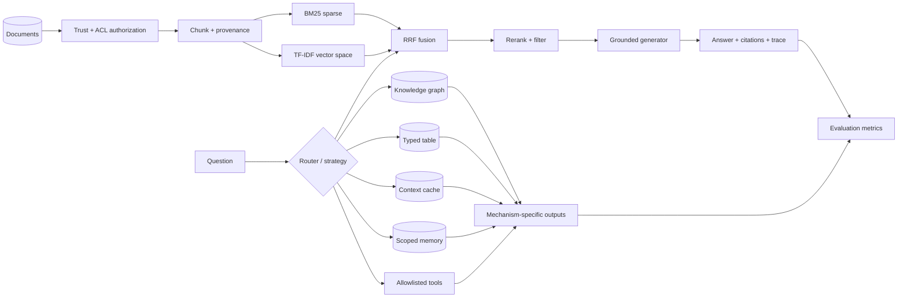

<div align="center">

# Knowledge Augmentation Lab

### One fact universe. Eight executable augmentation paths. Zero API keys required.

[](https://github.com/ashirimi1019/knowledge-augmentation-lab/actions/workflows/ci.yml)
[](https://www.python.org/)
[](tests/)
[](LICENSE)

**[Concept explorer](https://ashirimi1019.github.io/knowledge-augmentation-lab/) · [Run the lab](#quick-start) · [Taxonomy](docs/taxonomy.md) · [Decision guide](docs/decision-guide.md)**

</div>

---

Most projects show one vector search pipeline and call it “RAG.” This repository treats knowledge augmentation as a **system-design space**: retrieval, reusable context, structured knowledge, tables, memory, and tools are different mechanisms with different failure modes.

The default profile is intentionally dependency-light and deterministic. It runs on a laptop without an LLM key, keeps evidence and decisions visible, and separates **faithful implementations** from **mechanism-level teaching simulations**.

## What actually runs

| Path | Mechanism exercised | Status |
|---|---|---|
| **Naive RAG** | Recursive chunking → BM25 → grounded extractive answer → citations | ✅ Runnable |
| **Advanced / Hybrid RAG** | Query expansion → BM25 + TF-IDF → weighted RRF → rerank/filter | ✅ Runnable |
| **mini-KAG / KG-RAG** | Typed triples → entity matching → deterministic multi-hop traversal | ✅ Runnable |
| **GraphRAG mechanics** | Connected graph communities → inspectable community reports | 🧪 Teaching-scale approximation |
| **CAG mechanics** | Bounded corpus preload → repeated context reuse → cold/hit counters | 🧪 Context-reuse simulator, not a real model KV cache |
| **Memory augmentation** | User-scoped writes → relevance-ranked cross-turn recall | ✅ Runnable |
| **Table augmentation** | Typed filters/aggregations → row-level provenance | ✅ Runnable primitive; not a full TAG-Bench reproduction |
| **Tool augmentation** | Explicit allowlist → structured arguments → auditable output | ✅ Runnable |
| **Evaluation** | Recall@k, precision@k, MRR, lexical groundedness | ✅ Runnable |
| **Security** | Trust + ACL filtering before indexing/ranking | ✅ Runnable |

> **Why the labels matter:** Self-RAG, CRAG, Microsoft GraphRAG, OpenSPG KAG, database TAG, and KV-cache CAG are paper- or framework-specific. A generic prompt loop is not automatically Self-RAG, and caching a Python string is not a true model KV cache. The [taxonomy](docs/taxonomy.md) makes those boundaries explicit.

## Architecture



Every retrieval path returns the same typed objects: `Document`, `Chunk`, `RetrievalResult`, `AugmentationResult`, and `TraceStep`. That makes the architecture modular without hiding mechanics behind a framework.

## Quick start

```bash
git clone https://github.com/ashirimi1019/knowledge-augmentation-lab.git
cd knowledge-augmentation-lab
python -m venv .venv
```

Activate the environment:

```bash
# Windows
.venv\Scripts\activate

# macOS / Linux
source .venv/bin/activate
```

Install and execute all implemented families:

```bash
pip install -e ".[dev]"
kal showcase
```

Ask the same question through two retrieval pipelines:

```bash
kal demo "How does RAG ground generation?" --strategy naive-rag
kal demo "How does RAG ground generation?" --strategy advanced-rag
```

Explore the complete terminology catalog:

```bash
kal catalog
kal catalog --json
```

Run the visual lab:

```bash
pip install -e ".[app]"
streamlit run app.py
```

## The augmentation map

| Family | Question it answers | Representative methods |
|---|---|---|
| **Retrieval** | Which evidence should enter context for this query? | Naive, advanced, modular, hybrid, multi-query, HyDE, reranking, multi-hop, corrective, reflective, agentic, GraphRAG |
| **Reusable context** | Can a stable corpus be loaded once instead of retrieved each time? | Long-context prompting, prefix caching, CAG |
| **Structured knowledge** | Do relationships, rules, schemas, or calculations matter? | KG-RAG, mini-KAG, GraphRAG, Text2SQL, table augmentation, database TAG |
| **Memory** | What should persist and be recalled across interactions? | Working, episodic, semantic, and structured memory |
| **Tools** | Does the system need fresh data, exact computation, or an action? | Function calling, search, calculators, APIs, code, SQL |

`TAG` is overloaded in the literature and in engineering discussions. This project always spells out **Table-Augmented Generation** or **Tool-Augmented Generation** instead of relying on the acronym alone.

## Read the trace, not just the answer

```json
{
  "strategy": "advanced-rag",
  "citations": ["rag"],
  "trace": [
    {"name": "transform", "detail": "expanded the query"},
    {"name": "hybrid-retrieve", "detail": "fused BM25 and TF-IDF with RRF"},
    {"name": "rerank-filter", "detail": "kept relevant candidates"},
    {"name": "generate", "detail": "composed a context-only answer"}
  ]
}
```

A useful augmentation system should expose:

- source and chunk IDs;
- transformations and subqueries;
- scores and ranks;
- cache/memory/tool decisions;
- citations and abstentions;
- latency, cost, and evaluation configuration.

## Evaluation is layered

Retrieval quality is not answer quality. The lab separates:

1. **Retriever:** Recall@k, Precision@k, MRR, nDCG (extension).
2. **Context:** relevance, redundancy, token budget, evidence coverage.
3. **Answer:** correctness, groundedness, citation precision/recall, abstention.
4. **System:** p50/p95 latency, token/cost budget, cache hit rate, tool failures.
5. **Security:** source trust, ACL isolation, poisoning, indirect prompt injection, exfiltration.

See [Evaluation and safety](docs/evaluation-and-safety.md).

## Repository map

```text
knowledge-augmentation-lab/
├── app.py                         # Streamlit concept explorer and live comparison
├── site/index.html                # GitHub Pages visual map
├── src/knowledge_aug_lab/
│   ├── catalog.py                 # terminology and trade-off catalog
│   ├── retrieval.py               # BM25, TF-IDF, hybrid RRF
│   ├── pipelines.py               # naive and advanced RAG traces
│   ├── knowledge.py               # multi-hop graph + community reports
│   ├── augmentation.py            # context, table, memory, tool primitives
│   ├── evaluation.py              # deterministic metrics
│   ├── presentation.py            # escaped trace rendering for the visual app
│   ├── security.py                # pre-retrieval trust/ACL controls
│   ├── showcase.py                # all-family executable demo
│   └── cli.py                     # `kal` command
├── tests/                         # behavior-first test suite
└── docs/                          # taxonomy, architecture, decisions, safety
```

## Engineering choices

- **No mandatory cloud model.** The extractive generator keeps CI reproducible and proves grounding/citation behavior.
- **No fake “semantic” claim.** TF-IDF is called a vector-space baseline, not an embedding model. A dense-encoder backend belongs in an optional profile.
- **No fake CAG claim.** `ContextCache` demonstrates bounded context reuse; true CAG requires a model backend exposing real prefix/KV caching.
- **No fake Self-RAG claim.** The catalog explains Self-RAG’s trained reflection tokens rather than renaming a prompt-based critique loop.
- **Security before ranking.** ACL and trust checks happen before content can enter an index, not after retrieval.

## Tests

```bash
pytest -q
pytest --cov=knowledge_aug_lab --cov-report=term-missing
ruff check .
```

The suite covers chunking/retrieval, rank fusion, pipelines, graphs, cache reuse, table provenance, scoped memory, tool allowlists, metrics, catalog integrity, CLI behavior, and ACL isolation.

## Next production profiles

The default branch stays laptop-first. The [roadmap](docs/roadmap.md) describes optional, explicitly named profiles for:

- dense retrieval + cross-encoder reranking;
- bounded multi-hop / IRCoT-style retrieval;
- `crag-inspired` corrective routing and a faithful CRAG checkpoint profile;
- Microsoft GraphRAG local/global search;
- DuckDB + semantic operators on a TAG-Bench subset;
- Hugging Face `past_key_values` or provider prefix caching for true CAG experiments;
- official Self-RAG and OpenSPG KAG reproductions.

## References

Primary sources are linked in the [complete taxonomy](docs/taxonomy.md), including the original RAG paper, HyDE, Self-RAG, CRAG, IRCoT, GraphRAG, KAG, TAG, CAG, ReAct, Toolformer, Ragas, ARES, BEIR, PoisonedRAG, OWASP, and the NIST Generative AI Profile.

## License

MIT © 2026 Ashir Imran. See [LICENSE](LICENSE).
