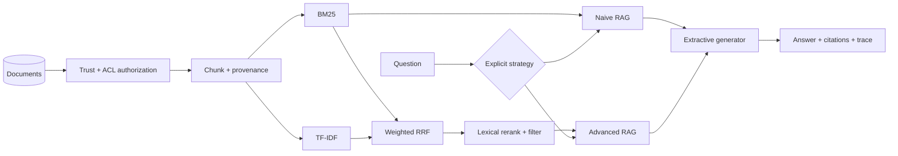

<div align="center">

# Knowledge Augmentation Lab

### Eight deterministic showcase examples. Two integrated RAG pipelines. Zero API keys required.

[](https://github.com/ashirimi1019/knowledge-augmentation-lab/actions/workflows/ci.yml)
[](https://www.python.org/)
[](tests/)
[](LICENSE)

**[Concept explorer](https://ashirimi1019.github.io/knowledge-augmentation-lab/) · [Run the lab](#quick-start) · [Evaluation](docs/evaluation.md) · [Threat model](docs/threat-model.md) · [Decision guide](docs/decision-guide.md)**

</div>

---

Most projects show one vector search pipeline and call it “RAG.” This repository treats knowledge augmentation as a **system-design space**: retrieval, reusable context, structured knowledge, tables, memory, and tools are different mechanisms with different failure modes.

The default profile is intentionally dependency-light and deterministic. It runs on a laptop without an LLM key, keeps evidence and decisions visible, and distinguishes runnable primitives from adjacent teaching simulations and unimplemented roadmap systems.

## What actually runs

| Path | Mechanism exercised | Execution | Fidelity / boundary |
|---|---|---|---|
| **Naive RAG** | Recursive chunking → BM25 → extractive answer → citations | Runnable | Faithful transparent primitive |
| **Advanced / Hybrid RAG** | Query expansion → BM25 + TF-IDF → weighted RRF → lexical rerank/filter | Runnable | Two lexical representations; adjacent to sparse+dense hybrid |
| **mini-KAG / KG-RAG** | Typed triples → entity matching → deterministic multi-hop traversal | Runnable | Adjacent to, not a reproduction of, OpenSPG KAG |
| **GraphRAG mechanics** | Connected components → inspectable community reports | Runnable simulation | Adjacent to Microsoft GraphRAG; no Leiden or LLM summaries |
| **CAG mechanics** | Bounded corpus preload → context reuse → cold/hit counters | Runnable simulation | Not a model KV cache |
| **Memory augmentation** | Scoped in-process writes → lexical recall | Runnable primitive | No persistence, deletion, provenance, or TTL |
| **Table augmentation** | Validated equality filters → finite aggregation → row indices | Runnable primitive | Database half only; not TAG-Bench |
| **Tool augmentation** | Name/kwarg allowlist → inspectable `ToolResult` | Runnable primitive | No value schema, timeout, sandbox, or audit log |
| **Evaluation** | Versioned fixture → RR/MRR, Recall/Precision, nDCG, lexical groundedness | Runnable regression | Three self-authored lexical cases; not a benchmark |
| **Security** | Trust + ACL filtering before document RAG indexing | Runnable boundary | Applies to `KnowledgeAugmentationLab`, not every standalone primitive |

> **Why the labels matter:** Self-RAG, CRAG, Microsoft GraphRAG, OpenSPG KAG, database TAG, and KV-cache CAG are paper- or framework-specific. A generic prompt loop is not automatically Self-RAG, and caching a Python string is not a true model KV cache. The [taxonomy](docs/taxonomy.md) makes those boundaries explicit.

## Architecture



The graph, table, memory, and tool adapters share `AugmentationResult` but are constructed separately; there is no adaptive controller routing all mechanisms. See [Architecture](docs/architecture.md).

## Quick start

```bash
git clone https://github.com/ashirimi1019/knowledge-augmentation-lab.git
cd knowledge-augmentation-lab
python -m venv .venv
```

Activate the environment:

```bash
# Windows
.venv\Scripts\activate

# macOS / Linux
source .venv/bin/activate
```

Install and execute all implemented families:

```bash
pip install -e ".[dev]"
kal showcase
```

Ask the same question through two retrieval pipelines:

```bash
kal demo "How does RAG ground generation?" --strategy naive-rag
kal demo "How does RAG ground generation?" --strategy advanced-rag
kal evaluate --check
```

Explore the complete terminology catalog:

```bash
kal catalog
kal catalog --json
```

Run the visual lab:

```bash
pip install -e ".[app]"
streamlit run app.py
```

## The augmentation map

| Family | Question it answers | Representative methods |
|---|---|---|
| **Retrieval** | Which evidence should enter context for this query? | Naive, advanced, modular, hybrid, multi-query, HyDE, reranking, multi-hop, corrective, reflective, agentic, GraphRAG |
| **Reusable context** | Can a stable corpus be loaded once instead of retrieved each time? | Long-context prompting, prefix caching, CAG |
| **Structured knowledge** | Do relationships, rules, schemas, or calculations matter? | KG-RAG, mini-KAG, GraphRAG, Text2SQL, table augmentation, database TAG |
| **Memory** | What should persist and be recalled across interactions? | Working, episodic, semantic, and structured memory |
| **Tools** | Does the system need fresh data, exact computation, or an action? | Function calling, search, calculators, APIs, code, SQL |

`TAG` is overloaded in the literature and in engineering discussions. This project always spells out **Table-Augmented Generation** or **Tool-Augmented Generation** instead of relying on the acronym alone.

## Read the trace, not just the answer

```json
{
  "strategy": "advanced-rag",
  "citations": ["rag"],
  "trace": [
    {"name": "transform", "detail": "expanded the query", "attributes": {"original_query": "...", "transformed_query": "..."}},
    {"name": "hybrid-retrieve", "detail": "fused BM25 and TF-IDF with RRF", "attributes": {"retrievers": ["bm25", "tfidf"], "candidate_count": 2}},
    {"name": "rerank-filter", "detail": "kept relevant candidates", "attributes": {"requested_top_k": 3, "selected_chunk_ids": ["rag#0"]}},
    {"name": "generate", "detail": "composed a context-only answer", "attributes": {"generator": "extractive", "citation_ids": ["rag"], "abstained": false}}
  ]
}
```

The current RAG trace exposes:

- source and chunk IDs;
- transformations and subqueries;
- citations and abstentions;

Per-result scores/ranks, latency, tokens, cost, revisions, and durable run IDs are production telemetry requirements, not current claims.

## Evaluation is layered

Retrieval quality is not answer quality. The lab separates:

1. **Implemented retriever metrics:** Recall@k, returned-result Precision@k, per-case RR, summary MRR, binary nDCG@k.
2. **Implemented answer proxy:** lexical groundedness plus deterministic citations/abstention.
3. **Required for broader claims:** context coverage, correctness/entailment, citation precision/recall, latency/cost, external and adversarial datasets.
4. **Separately tested security boundaries:** source trust, ACL isolation, immutable metadata, argument allowlists, escaped traces.

See [Evaluation and safety](docs/evaluation-and-safety.md).

## Repository map

```text
knowledge-augmentation-lab/
├── app.py                         # Streamlit concept explorer and live comparison
├── site/index.html                # GitHub Pages visual map
├── src/knowledge_aug_lab/
│   ├── catalog.py                 # terminology and trade-off catalog
│   ├── retrieval.py               # BM25, TF-IDF, hybrid RRF
│   ├── pipelines/                 # registry plus RAG/graph/table/memory/tool adapters
│   ├── knowledge.py               # multi-hop graph + community reports
│   ├── augmentation.py            # context, table, memory, tool primitives
│   ├── evaluation.py              # deterministic metric primitives
│   ├── evaluation_suite.py        # fixture validation, runner, baseline report
│   ├── fixtures/                  # packaged corpus and exact baseline
│   ├── presentation.py            # escaped trace rendering for the visual app
│   ├── security.py                # pre-retrieval trust/ACL controls
│   ├── showcase.py                # all-family executable demo
│   └── cli.py                     # `kal` command
├── scripts/quality.py             # complete cross-platform contributor gate
├── tests/                         # behavior-first and policy test suite
└── docs/                          # taxonomy, ADRs, evaluation, threat model
```

## Engineering choices

- **No mandatory cloud model.** The extractive generator keeps CI reproducible and proves grounding/citation behavior.
- **No fake “semantic” claim.** TF-IDF is called a vector-space baseline, not an embedding model. A dense-encoder backend belongs in an optional profile.
- **No fake CAG claim.** `ContextCache` demonstrates bounded context reuse; true CAG requires a model backend exposing real prefix/KV caching.
- **No fake Self-RAG claim.** The catalog explains Self-RAG’s trained reflection tokens rather than renaming a prompt-based critique loop.
- **Security before ranking.** ACL and trust checks happen before content can enter an index, not after retrieval.

## Tests

```bash
python scripts/quality.py
```

The one command runs Ruff, strict Pyright, branch-enabled coverage, wheel/sdist builds, strict Twine checks, isolated artifact installs, version checks, and installed CLI/evaluation smoke tests. See [Contributing](CONTRIBUTING.md).

## Next production profiles

The default branch stays laptop-first. The [roadmap](docs/roadmap.md) describes optional, explicitly named profiles for:

- dense retrieval + cross-encoder reranking;
- bounded multi-hop / IRCoT-style retrieval;
- `crag-inspired` corrective routing and a faithful CRAG checkpoint profile;
- Microsoft GraphRAG local/global search;
- DuckDB + semantic operators on a TAG-Bench subset;
- Hugging Face `past_key_values` or provider prefix caching for true CAG experiments;
- official Self-RAG and OpenSPG KAG reproductions.

## References

Primary sources are linked in the [complete taxonomy](docs/taxonomy.md), including the original RAG paper, HyDE, Self-RAG, CRAG, IRCoT, GraphRAG, KAG, TAG, CAG, ReAct, Toolformer, Ragas, ARES, BEIR, PoisonedRAG, OWASP, and the NIST Generative AI Profile.

## License

MIT © 2026 Ashir Imran. See [LICENSE](LICENSE).
