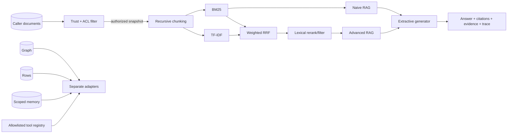

# Architecture

## Design goals

1. **Inspectable:** deterministic stages expose human-readable details plus immutable structured attributes.
2. **Modular:** retrieval, generation, graph, memory, table, and tool components have narrow contracts.
3. **Offline by default:** CI needs no model key or network at runtime.
4. **Honest fidelity:** lexical baselines and teaching simulations are not labeled as dense retrieval or faithful paper reproductions.
5. **Protected RAG path:** trust and ACL filtering precede chunking and indexing in `KnowledgeAugmentationLab`.

“Protected RAG path” is deliberately narrower than “secure by construction.” Standalone retrievers and graph, cache, table, memory, and tool primitives require callers to provide their own authorization and lifecycle controls.

## Actual execution paths

### Registered document pipelines

`KnowledgeAugmentationLab` authorizes documents once and registers exactly two strategies:

- `naive-rag`: recursive chunking → BM25 → positive-score evidence → extractive generator;
- `advanced-rag`: deterministic query expansion → BM25 + TF-IDF → weighted RRF → lexical rerank/filter → extractive generator.

Both share `Document`, `Chunk`, `RetrievalResult`, `TraceStep`, and `AugmentationResult` contracts.

### Separate adapters and primitives

Graph, table, memory, and tool adapters implement the pipeline protocol but are constructed separately from the document lab. `kal showcase` also calls `ContextCache` and several primitives directly. There is no adaptive router connecting all mechanisms into one agent.

## Shared types and invariants

- `Document`: normalized nonempty ID/text and recursively immutable metadata.
- `Chunk`: source ID, exact character span, text, and detached metadata.
- `RetrievalResult`: finite score, positive rank, retriever identity.
- `TraceStep`: stage name/detail plus recursively immutable structured attributes.
- `AugmentationResult`: immutable snapshots of citations, evidence, and trace.

Metadata uses a composition-based read-only `Mapping`, so inherited `dict` mutation descriptors cannot bypass the guard. Accepted leaves are JSON-safe finite scalars, mappings, and ordered sequences. `dataclasses.asdict` deep-copies this mapping to a plain dictionary for ordinary JSON encoding; model pickle round-trips remain supported.

## Trace contract

RAG traces currently expose:

- stage name and human-readable detail;
- document/chunk counts;
- original/transformed query for the hybrid transform stage;
- retriever names and candidate count;
- requested `top_k` and selected chunk IDs;
- generator identity, citation IDs, and abstention.

They do **not** expose per-result scores/ranks, latency, tokens, cost, model/data revision, or durable run IDs. Query-derived trace fields may be sensitive and must be treated as untrusted data by renderers/log sinks. The Streamlit helper HTML-escapes trace content.

## Generator boundary

`ExtractiveGenerator` copies and scores evidence sentences, attaches source IDs, and abstains when no supported candidate exists. It is not an LLM. A production model adapter should preserve context-only grounding, evidence IDs, citations, and abstention while adding model/prompt revision and token/latency/cost telemetry.

## Production replacement map

These are aspirational interfaces, not implemented integrations:

| Current component | Possible production replacement | Contract to retain |
|---|---|---|
| BM25 + TF-IDF | Dense encoder plus evaluated vector index | deterministic IDs, scores, ranks, metadata |
| In-memory chunks | pgvector/Qdrant/FAISS with access-aware ingestion | source/chunk identity and authorization |
| Lexical reranker | Cross-encoder/ColBERT | ranked candidate snapshot |
| Extractive generator | Local/hosted LLM | evidence-only answer, citations, abstention |
| Connected components | Entity resolution + Leiden + hierarchical summaries | graph evidence and report provenance |
| `ContextCache` simulator | Actual prefix/KV-cache backend | corpus/model/tokenizer/prompt revision |
| Python rows | Validated database plans | result plus row provenance |
| In-process tools | Authorized sandboxed executor | name/argument policy, timeout, audit, rollback |
