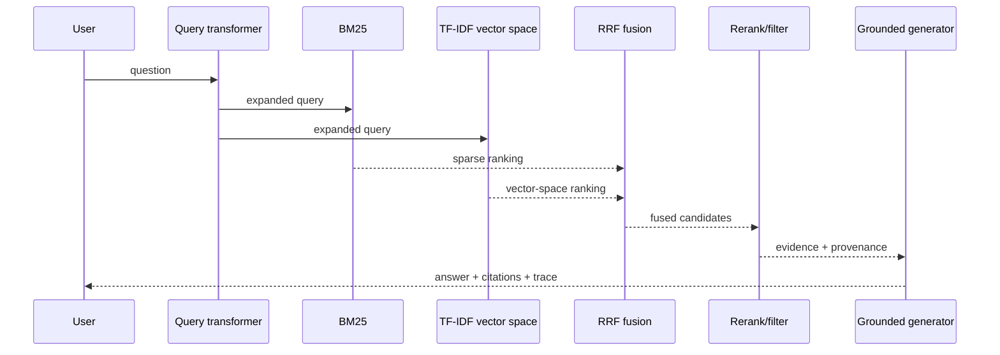

# Architecture

## Design goals

1. **Inspectable:** RAG stages emit decision traces; other primitives expose mechanism-specific outputs and provenance.
2. **Modular:** retrieval, generation, graph, memory, table, and tool components have narrow contracts.
3. **Deterministic by default:** CI does not need a model key or network access.
4. **Honest about fidelity:** teaching-scale mechanics and paper reproductions are labeled differently.
5. **Secure by construction:** source trust and ACL filtering happen before indexing/ranking.

## Shared types

- `Document`: source ID, text, and metadata.
- `Chunk`: document ID, character span, inherited metadata.
- `RetrievalResult`: chunk, score, rank, and retriever identity.
- `TraceStep`: stage name and human-readable decision detail.
- `AugmentationResult`: strategy, answer, citations, evidence, and trace.

`KnowledgeAugmentationLab(documents, *, scopes, trusted_only=True)` is the indexing contract. Callers must supply
the requester's scopes; the lab applies trust and ACL metadata before chunking and fitting either retriever, so
documents without an allowed scope (or without explicit trust by default) never enter an index.

## Retrieval path

BM25 and TF-IDF are implemented from first principles to keep scoring visible. The `Retriever` protocol allows an embedding/vector-database backend without changing orchestration.

## Non-retrieval paths

- `KnowledgeGraph`: typed triples, BFS neighborhoods, and deterministic toy community reports.
- `ContextCache`: corpus-size budget plus build/hit instrumentation for context-reuse experiments.
- `MemoryStore`: scope-isolated write/read behavior.
- `TableStore`: typed filters and aggregations with row indices as provenance.
- `ToolRegistry`: allowlisted functions and auditable arguments/output.

## Generator boundary

The default `ExtractiveGenerator` selects evidence sentences and appends source IDs. This is intentionally not marketed as an LLM. A production adapter can implement the same contract using an OpenAI-compatible endpoint, local Transformers model, or another provider.

A model adapter should preserve context-only instructions, abstention, structured citations, evidence IDs separate from untrusted content, model/prompt revision, and token/latency/cost telemetry.

## From teaching to production

| Current component | Production replacement | Contract retained |
|---|---|---|
| TF-IDF | sentence-transformers / hosted embeddings | `retrieve(query, top_k)` |
| In-memory chunks | Qdrant / pgvector / FAISS | chunk IDs + metadata |
| Lexical reranker | cross-encoder / ColBERT | ranked candidates |
| Extractive generator | local/hosted LLM | answer + citations |
| Connected components | entity resolution + Leiden communities | local/global graph evidence |
| Context string reuse | actual prefix/KV-cache backend | corpus revision + cache telemetry |
| Python rows | DuckDB with validated plans | result + row provenance |
